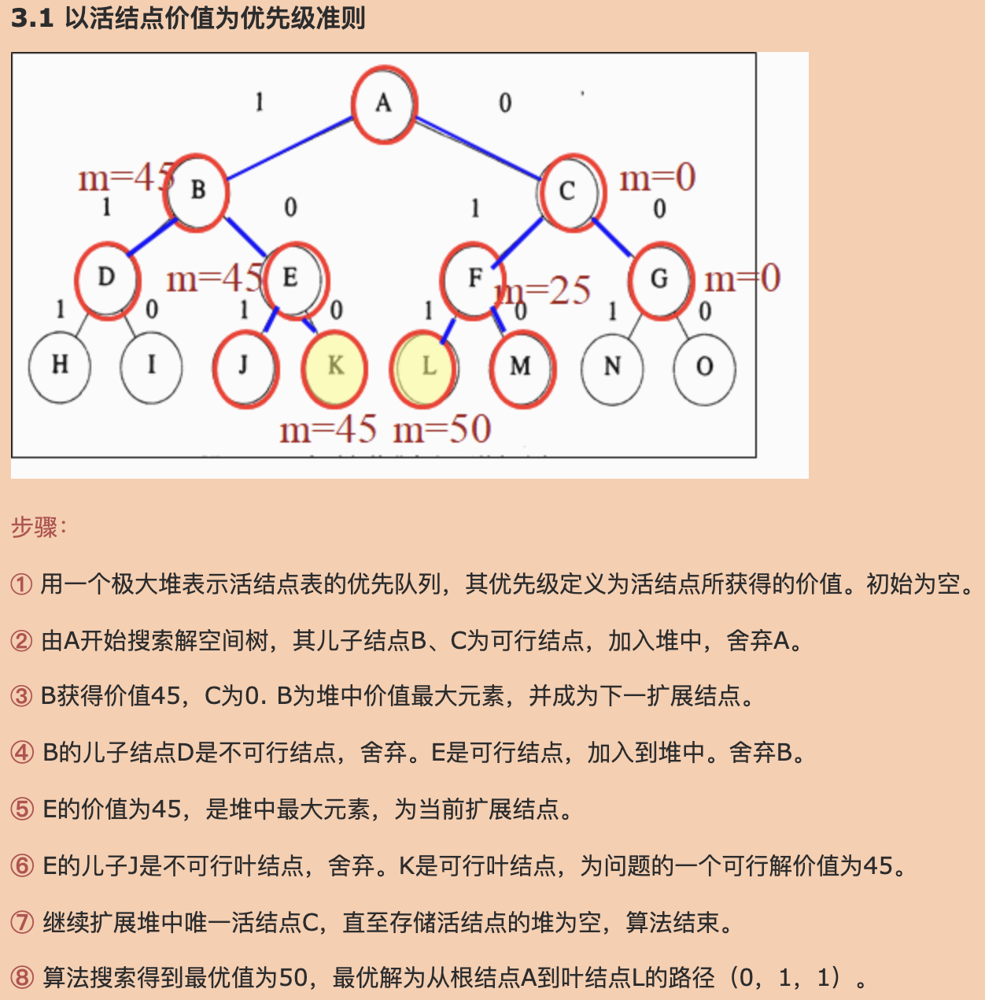
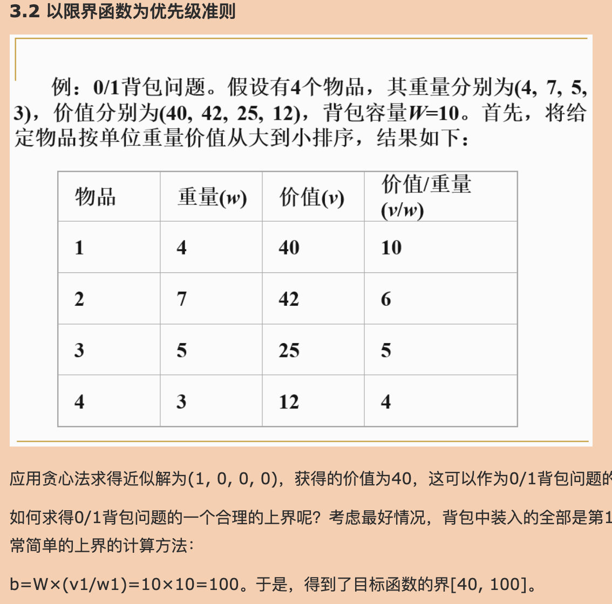

# 
背包问题

## 0-1背包
1. 动态规划
    - [代码](0-1%20knapsack/dp/dp.py)

2. 分支决策限界
    - [参考资料1-博客园](https://www.cnblogs.com/RB26DETT/p/10982687.html)
      - [下图方法代码实现](0-1%20knapsack/brand_and_bound/node_value.py)
        
      - [下图方法代码实现](0-1%20knapsack/brand_and_bound/bound_function.py)
        

    - [参考资料2-简书](https://www.jianshu.com/p/101128866e84) 
      - [代码](0-1%20knapsack/brand_and_bound/node_value_other.py)    

